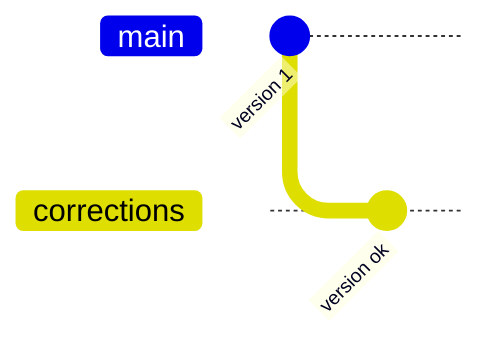

# Skill: JSON to GitHub

Ce skill convertit les fichiers JSON de quêtes (stockés dans `quests/todo/`) en dépôts GitHub utilisant le thème Jekyll Simplonline.

## Quand utiliser ce skill

- L'utilisateur demande de convertir une quest JSON en dépôt GitHub
- L'utilisateur demande de lister les quests en attente
- L'utilisateur veut pousser un dépôt local vers GitHub

## Structure du projet

```
odyssey-quests-to-github/
├── .opencode/skills/json-to-github/   # Ce skill
├── quests/
│   ├── todo/                          # JSON en attente
│   ├── archives/                      # JSON traités
│   └── REGISTRY.md                    # Registre des correspondances quest → repo
├── repos/                             # Dépôts générés (sortie)
└── AGENTS.md
```

## Flux de travail

### 1. Conversion d'une quest

Quand l'utilisateur demande de convertir une quest (ex: "Convertis quest-2114.json") :

0. **Vérifier si la quest a déjà été convertie** : lire `quests/REGISTRY.md` et chercher le quest_id. Si trouvé, informer l'utilisateur ("Cette quest a déjà été convertie : {URL}") et demander confirmation pour continuer (écraser le dépôt existant) ou annuler.
   - Si la quest n'est pas dans le registre, **ajouter une fiche** dans la section `🔄 En cours` (ou la créer si elle n'existe pas) :
     ```
     ### {Titre sans emojis}
     - **ID** : {quest_id} 
     - **Domaine** : {domain}
     - **Dépôt** : [simplonco/{domain}-{slug}](https://github.com/simplonco/{domain}-{slug})
     - **Site** : [simplonco.github.io/{domain}-{slug}](https://simplonco.github.io/{domain}-{slug}/)
     ```
     Maintenir l'ordre alphabétique par titre dans la section.
1. Demander à l'utilisateur la valeur de {domain} : à quel domaine est affecté ce contenu ? Valeurs possibles :
   - dev-web
   - data
   - infra
   - design
   - autre : préciser
2. **Lire le fichier JSON** depuis `quests/todo/`
3. **Extraire les métadonnées** :
   - `quest_id` → identifiant unique
   - `revision.title` → titre de la quest
   - `pages[]` → tableau des pages (content, solution)
4. **Slugifier le titre** pour le nom du dépôt :
   - Supprimer les emojis (ex: 👩‍🏫, ✅, 🤓)
   - Minuscules
   - Remplacer les espaces par des tirets
   - Supprimer les caractères spéciaux (ponctuation, accents)
   - Ex: "👩‍🏫 Installer et utiliser Visual Studio Code" → `installer-et-utiliser-visual-studio-code`
5. **Vérifier l'unicité du slug** : si `repos/{domain}-{slug}/` existe déjà, ajouter le `quest_id` : `{domain}-{slug}-{quest_id}`
6. **Créer le dossier** `repos/{domain}-{slug}/` et le sous-dossier `repos/{domain}-{slug}/images/`
7. **Générer les fichiers Jekyll** :
   - `README.md` → page principale (page avec chapter_type="content"). Ajouter un lien vers la page solution si elle existe en bas de page.
   - `solution.md` → page solution (si chapter_type="solution" existe). Ajouter " - Solution" au titre de la page dans le front matter.
   - `_config.yml` → copier depuis `templates/_config.yml` et remplacer les placeholders :
     - `{{TITLE}}` → "`revision.title`"
     - `{{DESCRIPTION}}` → "`revision.description`" (ou valeur par défaut si `null`)
   - `Gemfile` → copier depuis `templates/Gemfile`
   - `.gitignore` → copier depuis `templates/.gitignore`
   - `jekyll.yml` → copier depuis `templates/jekyll.yml` vers `repos/{domain}-{slug}/.github/workflows/jekyll.yml`
8. **Télécharger les images** :
   - Extraire toutes les URLs d'images du markdown (``)
   - Télécharger chaque image dans `repos/{domain}-{slug}/images/`
   - Renommer les fichiers avec un nom descriptif (pas d'URL longue)
   - Réécrire les URLs dans le markdown : ``
9. Créer le dépôt vide distant sur GitHub via `gh repo create` :
   - compte : `simplonco`
   - nom du dépôt : `{domain}-{slug}` 
   - description : `revision.description`
   - visibilité : public.
   - add a README file : non
   - gitignore : none
   - license : none
   - pousser le dépôt : non (sera fait manuellement par l'utilisateur après tests)
10. **Activer GitHub Pages** :
    ```bash
    gh api repos/simplonco/{domain}-{slug}/pages -X POST -f build_type=workflow
    ```
11. **Git init et premier commit** : 
    - initialiser un dépôt Git dans le répertoire
    - ajouter le remote `origin` au format ssh `git@github.com:simplonco/{domain}-{slug}.git` dans le dépôt local lié au dépôt GitHub créé précédemment
    - effectuer un premier commit d'initialisation
11. **Tester localement** (effectué manuellement par l'utilisateur) : `bundle exec jekyll serve --livereload`

### 2. Archiver

Lorsque l'utilisateur confirme que les tests, reviews et ajustement sont terminés :
    - **Générer un résumé** de la quest en analysant le contenu JSON source. Le résumé doit inclure :
      - Technologies abordées
      - Niveau de difficulté
      - Présence de ressources externes (vidéos YouTube, documentation, etc.)
      - Contenus interactifs (quiz, playground, exercices, etc.) mais pas les informations de mise en page (ex : "blocs d'exercices", "alertes", etc.)
      - Toute autre information utile
    - Ajouter le résumé comme dernière ligne de la fiche de la quest dans le registre
    - Informer l'utilisateur pour relecture et attendre sa **validation explicite** avant de poursuivre
    - **Mettre à jour le registre** dans `quests/REGISTRY.md` :
      - Déplacer la fiche de la section `🔄 En cours` vers `✅ Terminé`
      - Ajouter le résumé au registre sous les liens de la fiche et demander à l'utilisateur de relire et valider le résumé
      - Mettre à jour le compteur dans le titre de section
      - Maintenir l'ordre alphabétique par titre
    - déplacer le JSON vers `quests/archives/`
    - demander si le dossier doit être poussé sur GitHub. Si oui :
      ```bash
      cd repos/{domain}-{slug}
      git add .
      git commit -m "Relecture, corrections et validation"
      git push -u origin main
      ```
    - **Déplacer le dépôt local vers les archives** :
    ```bash
    mkdir -p repos/archives
    mv repos/{domain}-{slug} repos/archives/{domain}-{slug}
    ```

## Front Matter des pages

Définir le front matter pour chaque page :
```yaml
---
title: {{TITLE}}
description: {{DESCRIPTION}}
show_toc: true
---
```

S'il s'agit d'une page solution, ajouter :
```yaml
parent: titre-de-la-page-principale
```

## Conversion du markdown

### Mapping des syntaxes

| Syntaxe source | Équivalent Jekyll |
|---------------|-------------------|
| ` ```alert-info\n...\n``` ` | Contenu avec `{:.alert-info}` après chaque paragraphe |
| ` ```alert-warning\n...\n``` ` | Contenu avec `{:.alert-warning}` après chaque paragraphe |
| ` ```alert-error\n...\n``` ` | Contenu avec `{:.alert-warning}` (error → warning, le thème ne supporte pas alert-error) |
| ` ```alert-success\n...\n``` ` | Contenu avec `{:.alert-info}` (success → info, le thème ne supporte pas alert-success) |
| ` ```xtext story\n...\n``` ` | Bloc quote `> ` avec chaque ligne préfixée |
| ` ```xtext arrow\n...\n``` ` | Bloc quote `> ` avec chaque ligne préfixée |
| ` ```xtext intro\n...\n``` ` | Texte brut (paragraphe standard, pas de bloc quote) |
| ` ```js live\n...\n``` ` | Playground interactif (`playground.html`) |
| ` ```quests\n2114\n``` ` | Lien relatif vers le repo de la quest |
| ` ```ressource\n...\n``` ` | Bloc avec `{:.alert-info}` + contenu formaté |
| ` ````stepper\n...\n```` ` | Pass-through (le plugin `jekyll-stepper` gère le rendu) |
| ` ````solution\n...\n```` ` | Voir règle ci-dessous (details ou fichier séparé) |
| ` ```youtube\nURL\n``` ` | Lien markdown vers la vidéo (le thème auto-détecte les URLs YouTube) |
| ` ````tabs\n...\n```` ` | Dépliants `<details markdown="1">` avec `<summary>` |
| ` ```mermaid\n...\n``` ` | Image générée via mermaid.ink |

### Règles de conversion

#### Remplacement de termes

| Terme source | Terme cible |
|--------------|-------------|
| `quête` | `ressource` |
| `À la fin de cette quête tu sauras` | `Objectifs` |

#### Titres
- Vérifier que les titres sont bien formatés en Markdown (`#`, `##`, `###`, etc.) et respectent une hiérarchie logique.
- Supprimer le titre Sommaire si présent, car Jekyll génère automatiquement la table des matières.

#### Listes

Avant :
````
✅ Qu'est ce qu'un éditeur de code
✅ Comment installer Visual Studio Code.
````

Après :
```markdown
- ✅ Qu'est ce qu'un éditeur de code
- ✅ Comment installer Visual Studio Code.
```

#### Balisage spécial
Avant :
```
:def[HTML]{value="HyperText Markup Language"}
```
Après :
```markdown
HTML (HyperText Markup Language)
```

#### alert-info / alert-warning

Avant :
````
```alert-info
Contenu de l'alerte
```
````

Après :
```markdown
Contenu de l'alerte
{:.alert-info}
```

#### alert-error / alert-success

Le thème ne supporte que `alert-info` et `alert-warning`. Convertir :
- `alert-error` → `{:.alert-warning}` (proche visuellement)
- `alert-success` → `{:.alert-info}` (proche visuellement)

Même syntaxe de conversion que alert-info/alert-warning.

#### xtext story

Avant :
````
```xtext story
Bonjour,
Ceci est un brief.
```
````

Après :
```markdown
> Bonjour,
> Ceci est un brief.
```

#### xtext arrow

Avant :
````
```xtext arrow
**🎯 À toi de jouer !**
Ceci est un brief.
```
````

Après :
```markdown
> #### 🎯 À toi de jouer !
> Ceci est un brief.
```

Note : ajuster le niveau d'intertitre en cohérence avec la hiérarchie de la page.

#### xtext intro

Avant :
````
```xtext intro
Dans cette ressource, tu apprendras...
```
````

Après :
```markdown
Dans cette ressource, tu apprendras...
```

Le bloc `xtext intro` est un texte d'introduction — il est converti en paragraphe standard (pas de bloc quote).

#### js live (→ Playground interactif)

Les blocs `js live` contiennent du code HTML/CSS/JS séparé par des marqueurs `!--- nom-fichier.ext`. Le parser doit :
1. Séparer le bloc par les marqueurs `!--- `
2. Identifier le type selon le nom du fichier (`.html` → `my_html`, `.css` → `my_css`, `.js` → `my_js`)
3. Générer les blocs `` et l'include `playground.html`

**Avant** :
````
```js live
!--- index.html

<!DOCTYPE html>
<html>...</html>

!--- style.css

:root { ... }
```
````

**Après** :
````markdown

<!DOCTYPE html>
<html>...</html>



:root { ... }



````

**Variante inline** (si un seul type de code) :
````markdown

````

**Règles** :
- L'`id` doit être unique par page (utiliser un slug ou un numéro)
- Si le bloc contient uniquement HTML, utiliser la syntaxe inline
- Si le bloc contient HTML + CSS + JS, utiliser les 3 captures

#### quests (liens vers autres quests)

Avant :
````
```quests
2114
```
````

Après :
```markdown
[Voir la ressource "Installer et utiliser Visual Studio Code"](https://simplonco.github.io/dev-web-installer-et-utiliser-visual-studio-code/)
```

Note : utiliser l'**URL de déploiement** depuis `quests/REGISTRY.md` (colonne "URL de déploiement"). Si la quest cible n'est pas dans le registre, avertir l'utilisateur et lui demander ce qu'il souhaite faire : ignorer le lien, le renseigner manuellement ou le mettre à jour plus tard.

#### ressource

Avant :
````
```ressource
https://example.com
# Titre de la ressource
Description de la ressource
```
````

Après :
```markdown
**Titre de la ressource**

Description de la ressource

[Lien vers la ressource](https://example.com)
{:.alert-info}
```

#### solution (deux cas)

**Cas 1 — Solution de challenge en bas de page** : le bloc `solution` contient la réponse au challenge final. Le contenu doit être placé dans un fichier `solution.md` séparé (avec front matter `parent: titre-de-la-page-principale`). Remplacer le bloc dans le README.md par un lien :

Avant :
````
````solution
# Solution du challenge
Contenu de la solution...
````
````

Après (dans README.md) :
```markdown
---

[Voir la solution](solution){:.alert-info}
```

**Cas 2 — Solution inline dans le contenu** : si la solution apparaît au milieu du texte (ex: exercice pas à pas), utiliser un bloc `<details>` :

Avant :
````
````solution
Contenu de la solution...
````
````

Après :
```markdown
<details markdown="1">
<summary>Voir la solution</summary>

Contenu de la solution...

</details>
```

#### Quiz

Le JSON source peut contenir des quiz au format :
```quiz
# Question ?
[x] A
[] B
[] C
[] D
```

Convertir en :
````markdown

[{"question": "Question ?", "options": ["A", "B", "C", "D"], "correct": 0}]


````

#### youtube

Avant :
````
```youtube
https://www.youtube.com/watch?v=VIDEO_ID
```
````

Après :
```markdown
[Voir la vidéo YouTube](https://www.youtube.com/watch?v=VIDEO_ID)
```

Note : le thème auto-détecte les URLs YouTube dans le markdown et les remplace par des iframes embed (16:9, `youtube-nocookie.com`). Le lien markdown suffit.

#### tabs (→ dépliants)

Les blocs `tabs` contiennent des onglets séparés par des marqueurs `!--- nom-onglet`. Les convertir en dépliants `<details>` :

Avant :
````
````tabs
!--- Ubuntu
Tape simplement cette commande
```sh
sudo apt install gh
```

!--- Mac OS
Tape simplement cette commande
```sh
brew install gh
```
````
````

Après :
```markdown
<details markdown="1">
<summary>Ubuntu</summary>

Tape simplement cette commande
```sh
sudo apt install gh
```

</details>

<details markdown="1">
<summary>Mac OS</summary>

Tape simplement cette commande
```sh
brew install gh
```

</details>
```

Règles :
- Séparer le bloc par les marqueurs `!--- `
- Le nom après `!---` devient le contenu du `<summary>`
- Chaque onglet devient un bloc `<details markdown="1">` avec `<summary>` et contenu
- Garder une ligne vide avant et après le `<summary>`
- Fermer chaque bloc avec `</details>`

#### mermaid (→ image)

Les blocs `mermaid` sont convertis en images via l'API mermaid.ink.

Avant :
````

````

Étapes :
1. Encoder le code mermaid en base64
2. Télécharger l'image depuis `https://mermaid.ink/img/{base64}`
3. Sauvegarder dans `images/` avec un nom descriptif
4. Remplacer le bloc par une image markdown

Après :
```markdown

```

Commande pour générer l'image :
```bash
echo 'CODE_MERMAID' | base64 | tr -d '\n' | xargs -I {} curl -sL -o images/nom-image.png "https://mermaid.ink/img/{}"
```

#### stepper

Les blocs ````````stepper` du JSON source sont en **pass-through** — le plugin `jekyll-stepper` (inclus dans le Gemfile et `_config.yml`) gère le rendu automatiquement.

Le format attendu (4 backticks) :
````
````stepper
# Titre de l'étape 1
Contenu markdown de l'étape 1.

# Titre de l'étape 2
Contenu markdown de l'étape 2.
````
````

Chaque `# Titre` devient un en-tête accordion (`<summary>`). La navigation Previous/Next est ajoutée automatiquement.

**Important** : les blocs steppers utilisent 4 backticks (pas 3) pour permettre l'imbrication de blocs de code à 3 backticks à l'intérieur des étapes.

#### Liens vers des ressources externes
- Récupérer le titre de la page web pour l'utiliser comme titre de la ressource. Exemple : `https://developer.mozilla.org/fr/docs/Web/HTML` → `HTML: HyperText Markup Language`
- Formater le lien en markdown : `[Titre de la ressource](URL)`

## Artefacts du thème

Ces fonctionnalités sont gérées automatiquement par le thème Jekyll Simplonline — aucune conversion n'est nécessaire de la part du skill.

### YouTube (auto-détection JS)

Le module `YouTubeEmbedder` du thème détecte automatiquement les URLs YouTube dans le markdown et les remplace par des iframes embed (16:9, `youtube-nocookie.com`).

Patterns reconnus :
- `https://youtu.be/VIDEO_ID`
- `https://www.youtube.com/watch?v=VIDEO_ID`

Les blocs `youtube` du JSON source sont convertis en liens markdown par le skill (voir section "youtube" dans les règles de conversion). Le thème détecte ensuite ces URLs et les remplace par des embeds.

### Stepper (plugin Jekyll)

Le plugin `jekyll-stepper` convertit automatiquement les blocs ````````stepper` en composants accordion avec navigation Previous/Next. Voir la section "stepper" dans les règles de conversion pour le format attendu.

### Quiz (include Jekyll)

Les quiz sont convertis manuellement par le skill (voir section "quiz" dans les règles de conversion) en utilisant ``.

## Templates

Les templates se trouvent dans `templates/` :
- `_config.yml` : Configuration Jekyll avec le thème simplonline
- `Gemfile` : Dépendances Ruby (jekyll, webrick, jekyll-remote-theme, jekyll-readme-index, jekyll-stepper)
- `.gitignore` : Fichiers à ignorer (_site/, .jekyll-cache/, etc.)

## Structure d'un dépôt généré

```
repos/{domain}-{slug}/
├── README.md        # Page principale (content)
├── solution.md      # Page solution (si existe)
├── images/          # Images téléchargées
├── _config.yml      # Config Jekyll
├── Gemfile          # Dépendances
└── .gitignore       # Fichiers à ignorer
```

## Commandes Jekyll pour test local

### Installation des dépendances

```bash
cd repos/{domain}-{slug}
bundle install
```

### Lancer le serveur local

```bash
bundle exec jekyll serve --livereload
```

Le site sera disponible sur `http://localhost:4000`

## Limitations

- Les emojis dans les titres sont supprimés lors du slugifield
- Les images externes (storage.googleapis.com) sont téléchargées dans le dossier `/images` et les URLs réécrites
- Les liens vers d'autres quests utilisent le format `quest-{id}` si le slug n'est pas connu
- `alert-error` et `alert-success` ne sont pas supportés par le thème — ils sont convertis en `alert-warning` et `alert-info` respectivement
